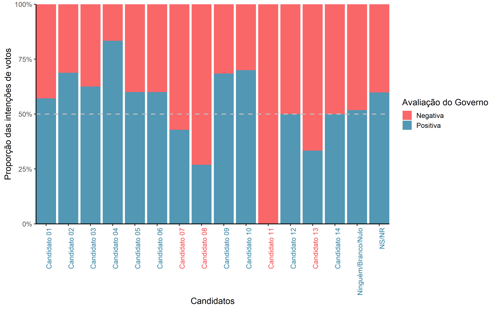

## Avaliação técnica Quaest Pesquisa e Consultoria (Data Scientist)

Os primeiros passos realizados nesta análise foram alguns ajustes feitos no banco de dados. Segue abaixo estes passos.
```R
#pacotes utilizados
library(ggplot2)
library(questionr)
library(treemapify)
library(treemap)

#diretório
setwd("~/avaliacao_cientista_de_dados_quaest")

#função
firstup <- function(x) {
  substr(x, 1, 1) <- toupper(substr(x, 1, 1))
  x
}

#dados
dados = read.csv("bd_surveyquaest.csv", sep = ";")

#criação de variáveis
dados$idade2 = cut(dados$idade,breaks=c(17, 35, 45, 65, 87), right = FALSE)
dados$renda2 = ifelse(dados$rendaf == "Até R$ 1.045,00 (até 1 SM)", "Até 1SM",
                      ifelse(dados$rendaf == "De R$ 1.046,00 a R$ 2.090,00 (+ de 1SM até 2 SM)", "+ 1 até 2SM",
                             ifelse(dados$rendaf == "De R$ 2.091,00 a R$ 3.135,00 (+ de 2SM até 3 SM)", "+ 2 até 3SM",
                                    ifelse(dados$rendaf == "De R$ 3.136,00 a R$ 5.225,00 (+ de 3SM até 5 SM)", "+ 3 até 5SM",
                                           ifelse(dados$rendaf == "De R$ 5.226,00 a R$ 10.450,00 (+ de 5SM até 10 SM)", "+ 5 até 10SM",
                                                  ifelse(dados$rendaf == "De R$ 10.451,00 a R$ 15.675,00 (+ de 10SM até 15 SM)", "+ 10 até 15SM" , "+ 15"))))))

dados$esc2 = dados$esc
dados$esc2 = gsub("Ensino ", "", dados$esc2 )
dados$esc2 = gsub("completo", "comp.", dados$esc2 )
dados$esc2 = gsub("incompleto", "incomp.", dados$esc2 )
dados$esc2 = gsub("fundamental", "Fundam.", dados$esc2 )
dados$esc2 = gsub("superior", "Sup.", dados$esc2 )
dados$esc2 = gsub("Sem instrução e menos de 1 ano de estudo", "Sem instr. e menos de 1 ano de estudo", dados$esc2 )
dados$esc2 = firstup(dados$esc2)
dados$count = 1
```


Dando continuidade, uma nova função foi criada, onde nela é inserida a variável que será comparada em relação a intenção de voto, por exemplo, se desejo saber a intenção de votos de acordo com a idade, insiro a variável "idade" na função `tabela_cont()`, como saída, obtenho o número total de intenção de votos para cada candidato e também a procentagem dentro e cada grupo, como pode ser visto abaixo.
```R
tabela_cont = function(variavel){
  n = addmargins(table(dados$voto1,  dados[,variavel]),1)
  perc = round(addmargins(prop.table(table(dados$voto1, dados[,variavel]), margin=2)*100,1),2)
  valores = paste0(n, " (", perc, "%)")
  for (i in 1:dim(n)[2]) {
    n[,i] = valores[(1 + (i-1)*dim(n)[1]):(i * dim(n)[1])]
  }
  return(n)
}

#exemplos de aplicações: tabela_cont('idade2'); tabela_cont('renda2'); tabela_cont('esc2'); tabela_cont('aval_gov2')
tabela_cont('sexo')
                     
#                     Feminino     Masculino   
# Candidato 01        11 (2.02%)   31 (6.81%)  
# Candidato 02        295 (54.13%) 228 (50.11%)
# Candidato 03        9 (1.65%)    7 (1.54%)   
# Candidato 04        4 (0.73%)    8 (1.76%)   
# Candidato 05        14 (2.57%)   11 (2.42%)  
# Candidato 06        7 (1.28%)    3 (0.66%)   
# Candidato 07        3 (0.55%)    4 (0.88%)   
# Candidato 08        14 (2.57%)   12 (2.64%)  
# Candidato 09        7 (1.28%)    12 (2.64%)  
# Candidato 10        14 (2.57%)   6 (1.32%)   
# Candidato 11        1 (0.18%)    2 (0.44%)   
# Candidato 12        3 (0.55%)    3 (0.66%)   
# Candidato 13        2 (0.37%)    1 (0.22%)   
# Candidato 14        6 (1.1%)     0 (0%)      
# Ninguém/Branco/Nulo 72 (13.21%)  70 (15.38%) 
# NS/NR               83 (15.23%)  57 (12.53%) 
# Sum                 545 (100%)   455 (100%)  
```

### Gráfico da Intenção de voto
Nesta seção será apresentado o gráfico que contém o total da intenção de votos para cada candidato. 
```R
dados_fig1 = aggregate(count ~ voto1, data = dados, FUN = sum)

treemap1 <- treemap(dados_fig1, 
                    index=c("voto1"),  
                    vSize = "count",  
                    type="index", 
                    palette = "Spectral",  
                    title="Intenção de votos", 
                    fontsize.title = 14 
)
hctreemap(treemap1, allowDrillToNode = TRUE) %>% 
  hc_title(text = "Intenção de votos") %>% 
  hc_tooltip(pointFormat = "<b>{point.name}</b>:<br>
                              Total Recebido: {point.value:,.0f}") %>% 
  hc_exporting(enabled = TRUE)
```


```{r treemap, fig.keep='none', out.width = '70%'}
treemap1 <- treemap(a, #Your data frame object
        index=c("Exportador"),  #A list of your categorical variables
        vSize = "ValordaOperacaoemUM",  #This is your quantitative variable
        type="index", #Type sets the organization and color scheme of your treemap
        palette = "Spectral",  #Select your color palette from the RColorBrewer presets or make your own.
        title="Valores dos Empréstimos", #Customize your title
        fontsize.title = 14 #Change the font size of the title
)
```

```{r treemap int}
hctreemap(treemap1, allowDrillToNode = TRUE) %>% 
  hc_title(text = "Figura 2: Proporção do total emprestado para cada empresa") %>% 
    hc_tooltip(pointFormat = "<b>{point.name}</b>:<br>
                              Total Recebido: {point.value:,.0f}") %>% 
  hc_exporting(enabled = TRUE)
```


No segundo gráfico temos os valores referentes ao cruzamento entre as variáveis intenção de voto e avaliação do governo. Para a criação do banco para esta análise foram retirados as observações onde o indivíduo não sabia ou não responde sobre a avaliação do governo, como pode ser visto no código abaixo. Em seguida foram criadas duas variáveis, uma representando as opiniões positivas e a outras as opiniões negativas.

```R
#dados para a figura 2
dados2 = dados[-which(dados$aval_gov == "NS/NR"),]
dados2$aval_gov2 = ifelse((dados2$aval_gov == "Boa") | (dados2$aval_gov == "Ótima ") | 
                            (dados2$aval_gov == "Regular positiva"), "Positiva",  "Negativa") 
                            
dados_fig2 = aggregate(count ~ aval_gov2 + voto1, data = dados2, FUN = sum)

fig2 = ggplot(dados_fig2) +
  geom_bar( aes(y = count, x =voto1, fill = aval_gov2), position = "fill", alpha = .8,color="transparent", stat = "identity")+
  ylab("Proporção das intenções de votos") +xlab("Candidatos") + 
  scale_y_continuous(labels = scales::percent) +
  coord_cartesian(  expand = FALSE) +
  scale_fill_manual("Avaliação do Governo",c("Negativa", "Positiva"), values = c("#f94144", "#277da1" ))+
  theme_classic(base_size = 15) +
  geom_hline(yintercept=.5, linetype="dashed", 
             color = "grey", size=1) +
  theme(axis.text.x=element_text(angle = 90, hjust = 1),
        axis.text.y.right = element_text(color = "black"),
        panel.background = element_blank()) ; fig2

ggsave("fig2.png",fig2, width=4, height=2.5, units="in", scale=3)
```
Figura 2: Intenção de voto X Avaliação do Governo


Na Figura 2, pode-se observar que mais da metade dos indivíduos que possuem intenção de votar no Candidato 7 fez uma avaliação de forma negativa do governo. O mesmo ocorreu para os indivíduos que planejam votar nos candidatos 8, 11 e 13. Vale ressaltar que dos indivíduos com intenção de voto para os candidatos 12 e 14, metade fez uma avaliação positiva do governo e a outra metade negativa.

